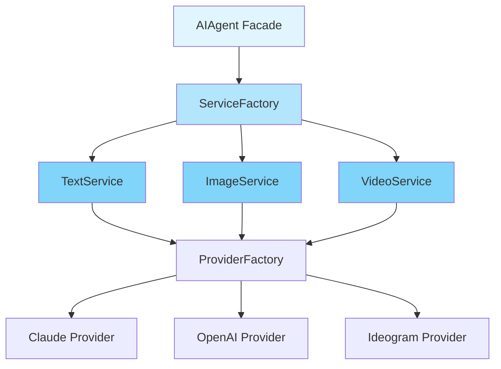
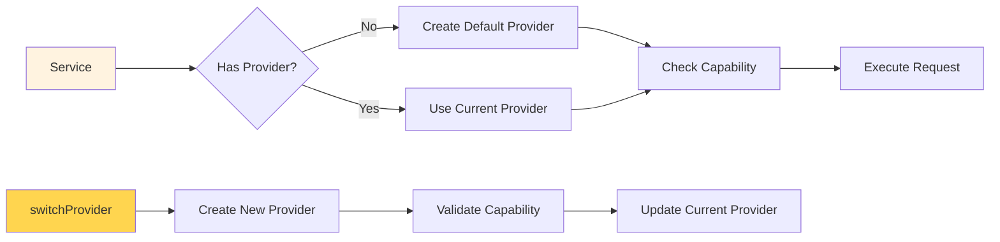

# 📚 Service Agent Documentation

## 🎯 Overview

A comprehensive guide to using AI services and creating custom providers in the AI Agent Laravel package.

## 📋 Table of Contents
- [Overview](#overview)
- [Core Services](#core-services)
  - [Text Service](#text-service)
  - [Image Service](#image-service)
- [Provider & Model Switching](#provider--model-switching)
- [Creating Custom Providers](#creating-custom-providers)
- [Configuration](#configuration)
- [Examples](#examples)

## Overview

The AI Agent package provides a flexible service layer for integrating multiple AI providers. Each service (Text, Image, Video) can dynamically switch between providers and models at runtime.



## Core Services

### Text Service

The `TextService` handles all text generation operations with support for streaming and provider switching.

#### Basic Usage

```php
use Kaviyarasu\AIAgent\Facades\AIAgent;

// Generate text with default provider
$response = AIAgent::text()->generateText('Write a short story about AI');

// Generate with options
$response = AIAgent::text()->generateText('Explain quantum computing', [
    'temperature' => 0.7,
    'max_tokens' => 500
]);

// Stream text responses
foreach (AIAgent::text()->streamText('Tell me about Laravel') as $chunk) {
    echo $chunk;
}
```

#### Provider Switching

```php
// Switch to a specific provider
AIAgent::text()
    ->switchProvider('openai')
    ->generateText('Generate content with OpenAI');

// Temporary provider switching
AIAgent::text()->withProvider('claude', function($service) {
    return $service->generateText('This uses Claude temporarily');
});
```

#### Model Switching

```php
// Switch to a specific model
AIAgent::text()
    ->switchModel('claude-3-opus-20240229')
    ->generateText('Using Opus model');

// Temporary model switching
AIAgent::text()->withModel('gpt-4', function($service) {
    return $service->generateText('This uses GPT-4 temporarily');
});
```

### Image Service

The `ImageService` handles image generation with support for multiple images and various options.

#### Basic Usage

```php
use Kaviyarasu\AIAgent\Facades\AIAgent;

// Generate single image
$imageUrl = AIAgent::image()->generateImage('A futuristic city at sunset');

// Generate with options
$imageUrl = AIAgent::image()->generateImage('Abstract art', [
    'size' => '1024x1024',
    'style' => 'vivid',
    'quality' => 'hd'
]);

// Generate multiple images
$imageUrls = AIAgent::image()->generateMultipleImages('Cyberpunk character', 4, [
    'size' => '512x512'
]);
```

#### Provider-Specific Features

```php
// Ideogram specific styles
AIAgent::image()
    ->switchProvider('ideogram')
    ->generateImage('Anime character', [
        'style' => 'ANIME',
        'aspect_ratio' => 'ASPECT_16_9'
    ]);

// DALL-E 3 quality settings
AIAgent::image()
    ->switchProvider('openai')
    ->switchModel('dall-e-3')
    ->generateImage('Photorealistic portrait', [
        'quality' => 'hd',
        'size' => '1024x1792'
    ]);
```

## Provider & Model Switching

### Understanding the Architecture



### Dynamic Provider Switching

```php
// Get available providers for a service
$providers = AIAgent::text()->getAvailableProviders();
// Returns: ['claude' => [...], 'openai' => [...]]

// Check if provider is available
if (AIAgent::text()->hasProvider('openai')) {
    AIAgent::text()->switchProvider('openai');
}

// Get current provider
$current = AIAgent::text()->getCurrentProvider();
```

### Model Management

```php
// Get available models for current provider
$models = AIAgent::text()->getAvailableModels();

// Get model capabilities
$capabilities = AIAgent::text()->getModelCapabilities();
// Returns: ['max_tokens' => 4096, 'supports_streaming' => true, ...]

// Check specific model capabilities
$modelCaps = AIAgent::text()->getModelCapabilities('claude-3-opus-20240229');
```

## Creating Custom Providers

### Step 1: Create Provider Class

Create a new provider that extends `AbstractProvider` and implements required interfaces:

```php
<?php

namespace App\AI\Providers;

use Kaviyarasu\AIAgent\Providers\AI\AbstractProvider;
use Kaviyarasu\AIAgent\Contracts\Capabilities\TextGenerationInterface;
use Illuminate\Support\Facades\Http;

class CustomAIProvider extends AbstractProvider implements TextGenerationInterface
{
    protected array $supportedModels = [
        'custom-model-v1',
        'custom-model-v2'
    ];
    
    protected array $modelCapabilities = [
        'custom-model-v1' => [
            'max_tokens' => 2048,
            'supports_streaming' => false,
            'supports_functions' => true,
            'name' => 'Custom Model v1',
            'version' => '1.0'
        ],
        'custom-model-v2' => [
            'max_tokens' => 4096,
            'supports_streaming' => true,
            'supports_functions' => true,
            'name' => 'Custom Model v2',
            'version' => '2.0'
        ]
    ];
    
    private const API_URL = 'https://api.custom-ai.com/v1/completions';
    
    public function getName(): string
    {
        return 'CustomAI';
    }
    
    public function getVersion(): string
    {
        return '1.0';
    }
    
    public function supports(string $capability): bool
    {
        return in_array($capability, ['text']);
    }
    
    public function getCapabilities(): array
    {
        return ['text'];
    }
    
    public function generateText(array $params): string
    {
        $response = Http::withHeaders([
            'Authorization' => 'Bearer ' . $this->getApiKey(),
            'Content-Type' => 'application/json',
        ])->post(self::API_URL, [
            'model' => $this->currentModel,
            'prompt' => $params['prompt'],
            'max_tokens' => $params['max_tokens'] ?? $this->getMaxTokens(),
            'temperature' => $params['temperature'] ?? 0.7,
        ]);
        
        if (!$response->successful()) {
            throw new \Exception('Custom AI API error: ' . $response->body());
        }
        
        return $response->json()['text'] ?? '';
    }
    
    public function streamText(array $params): iterable
    {
        // Implement streaming logic
        throw new \Exception('Streaming not implemented');
    }
    
    public function getMaxTokens(): int
    {
        return $this->modelCapabilities[$this->currentModel]['max_tokens'] ?? 2048;
    }
    
    public function getDefaultModel(): string
    {
        return 'custom-model-v1';
    }
}
```

### Step 2: Register Provider in Configuration

Add your custom provider to `config/ai-agent.php`:

```php
'providers' => [
    // ... existing providers ...
    
    'customai' => [
        'api_key' => env('CUSTOMAI_API_KEY'),
        'class' => \App\AI\Providers\CustomAIProvider::class,
        'models' => [
            'custom-model-v1' => [
                'name' => 'Custom Model v1',
                'version' => '1.0',
                'max_tokens' => 2048,
                'capabilities' => ['text'],
                'supports_streaming' => false,
                'supports_functions' => true,
            ],
            'custom-model-v2' => [
                'name' => 'Custom Model v2',
                'version' => '2.0',
                'max_tokens' => 4096,
                'capabilities' => ['text'],
                'supports_streaming' => true,
                'supports_functions' => true,
            ],
        ],
        'default_model' => env('CUSTOMAI_MODEL', 'custom-model-v1'),
    ],
],
```

### Step 3: Use Your Custom Provider

```php
// Switch to custom provider
AIAgent::text()
    ->switchProvider('customai')
    ->generateText('Hello from custom AI!');

// Use specific model
AIAgent::text()
    ->switchProvider('customai')
    ->switchModel('custom-model-v2')
    ->generateText('Using v2 model');
```

## Configuration

### Provider Configuration Structure

```php
'providers' => [
    'provider_name' => [
        'api_key' => env('PROVIDER_API_KEY'),
        'class' => ProviderClass::class,
        'models' => [
            'model-id' => [
                'name' => 'Display Name',
                'version' => '1.0',
                'max_tokens' => 4096,
                'capabilities' => ['text', 'image'],
                'supports_streaming' => true,
                'supports_functions' => false,
                // Additional model-specific config
            ],
        ],
        'default_model' => 'model-id',
    ],
],
```

### Fallback Configuration

```php
'fallback_providers' => [
    'text' => ['claude', 'openai', 'customai'],
    'image' => ['ideogram', 'openai'],
],
```

## Examples

### Example 1: Multi-Provider Content Generation

```php
use Kaviyarasu\AIAgent\Facades\AIAgent;

class ContentGenerator
{
    public function generateArticle(string $topic)
    {
        // Generate outline with Claude
        $outline = AIAgent::text()
            ->switchProvider('claude')
            ->switchModel('claude-3-5-sonnet-20241022')
            ->generateText("Create an article outline about: {$topic}");
        
        // Generate detailed content with GPT-4
        $content = AIAgent::text()
            ->switchProvider('openai')
            ->switchModel('gpt-4')
            ->generateText("Write a detailed article based on this outline: {$outline}");
        
        // Generate feature image
        $image = AIAgent::image()
            ->switchProvider('ideogram')
            ->generateImage("Article header image for: {$topic}", [
                'style' => 'REALISTIC',
                'aspect_ratio' => 'ASPECT_16_9'
            ]);
        
        return [
            'title' => $topic,
            'outline' => $outline,
            'content' => $content,
            'feature_image' => $image
        ];
    }
}
```

### Example 2: Provider Fallback Pattern

```php
class ResilientAIService
{
    protected array $textProviders = ['claude', 'openai', 'customai'];
    
    public function generateWithFallback(string $prompt)
    {
        foreach ($this->textProviders as $provider) {
            try {
                return AIAgent::text()
                    ->switchProvider($provider)
                    ->generateText($prompt);
            } catch (\Exception $e) {
                logger()->warning("Provider {$provider} failed", [
                    'error' => $e->getMessage()
                ]);
                continue;
            }
        }
        
        throw new \Exception('All providers failed');
    }
}
```

### Example 3: Model Comparison

```php
class ModelBenchmark
{
    public function compareModels(string $prompt)
    {
        $results = [];
        
        // Test Claude models
        $claudeModels = [
            'claude-3-opus-20240229',
            'claude-3-5-sonnet-20241022',
            'claude-3-haiku-20240307'
        ];
        
        foreach ($claudeModels as $model) {
            $start = microtime(true);
            
            $response = AIAgent::text()
                ->switchProvider('claude')
                ->switchModel($model)
                ->generateText($prompt);
            
            $results[$model] = [
                'response' => $response,
                'time' => microtime(true) - $start,
                'tokens' => str_word_count($response)
            ];
        }
        
        return $results;
    }
}
```

### Example 4: Service Capabilities Check

```php
class AICapabilityChecker
{
    public function checkServiceCapabilities()
    {
        $textService = AIAgent::text();
        
        // Get all available providers
        $providers = $textService->getAvailableProviders();
        
        foreach ($providers as $name => $info) {
            echo "Provider: {$name}\n";
            echo "Available: " . ($info['available'] ? 'Yes' : 'No') . "\n";
            
            if ($info['available']) {
                $textService->switchProvider($name);
                $models = $textService->getAvailableModels();
                
                foreach ($models as $model) {
                    $caps = $textService->getModelCapabilities($model);
                    echo "  Model: {$model}\n";
                    echo "    Max Tokens: {$caps['max_tokens']}\n";
                    echo "    Streaming: " . ($caps['supports_streaming'] ? 'Yes' : 'No') . "\n";
                }
            }
        }
    }
}
```

## Best Practices

1. **Always check provider availability** before switching
2. **Use temporary switching** (`withProvider`, `withModel`) for one-off operations
3. **Implement fallback patterns** for production reliability
4. **Cache provider instances** (handled automatically by the package)
5. **Configure appropriate models** for different use cases (cost vs quality)

## Troubleshooting

| Issue | Solution |
|-------|----------|
| Provider not found | Check if provider is registered in `config/ai-agent.php` |
| Model not supported | Verify model is listed in provider's `models` configuration |
| API key missing | Ensure environment variable is set (e.g., `CLAUDE_API_KEY`) |
| Capability not supported | Check provider's `capabilities` array includes required capability |

---

For more information, see the [full documentation](https://github.com/kaviyarasu-dev/agent).